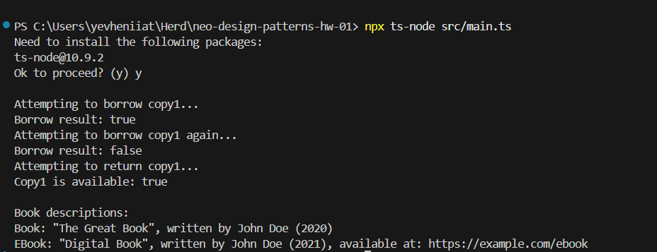

# Домашнє завдання №1 — Design Patterns

Цей проєкт є реалізацією предметної області «Бібліотека» з використанням принципів ООП: інкапсуляції, композиції, наслідування та поліморфізму.
Library model with support for objects: books, authors, physical copies, readers, library as an aggregator.

## Запуск проєкту

```bash
npx ts-node src/main.ts
```

## Очікувана функціональність
```bash
Attempting to borrow copy1...
Borrow result: true
Attempting to borrow copy1 again...
Borrow result: false
Attempting to return copy1...
Copy1 is available: true

Book descriptions:
Physical book "The Great Book" by John Doe (2020)
E-book "Digital Book" by John Doe (2021) - Available at: <https://example.com/ebook>
```


### Основні класи:

- **`Author`** зберігає ім’я та список написаних книг.
- **`Book`** реалізує `AbstractBook`, містить назву, рік, автора.
- **`EBook`** реалізує `AbstractBook`, додає поле `url`.
- **`Copy`** містить посилання на книгу та прапорець `isAvailable`.
- **`Reader`** має унікальний `id`, ім’я та список позичених копій.
- **`Library`** надає методи для:
  - додавання книг, авторів, копій, читачів
  - отримання вільних копій
  - пошуку книг за автором
- **`BorrowService`** окремий сервіс для позичання книги читачу `borrow(reader: Reader, copy: Copy)`.
